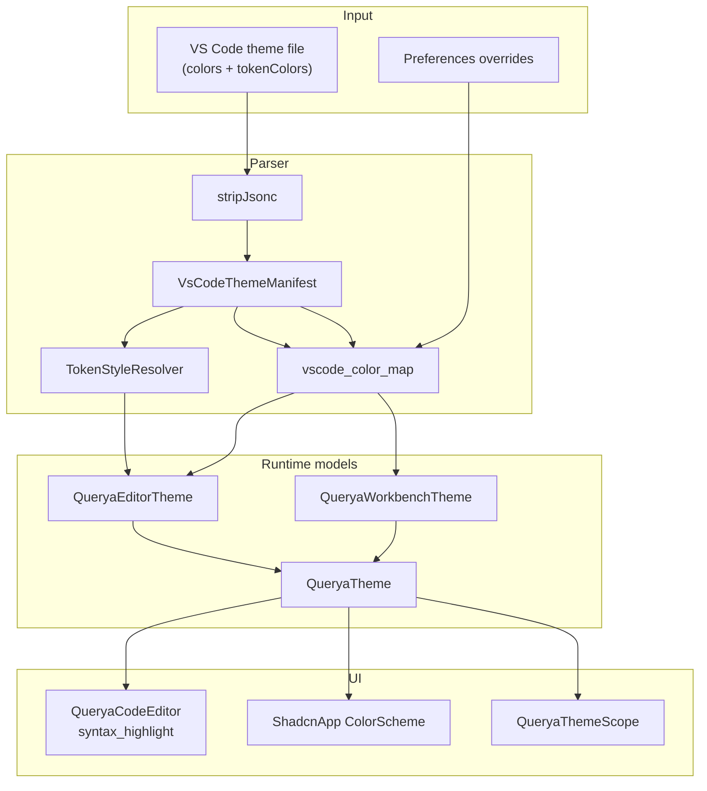

# Querya theme system

Querya Desktop uses a VS Code–inspired theme pipeline: workbench chrome colors,
editor syntax tokens, and optional import of community `.json` / `.jsonc` themes.

## Architecture



| Layer | Purpose |
|-------|---------|
| **Workbench** | Sidebar, tabs, canvas, accents, git decoration |
| **Editor** | SQL/JSON editor surface, selection, line numbers, syntax token hues |
| **ColorScheme** | shadcn/Material widgets (buttons, inputs, dialogs) |

`ThemeController` merges layers, persists settings in `AppSettings`, and drives
`QueryaApp` via `ListenableBuilder`.

## Built-in presets

- **Querya Dark** — default (`QueryaThemePreset.queryaDark`)
- **Querya Light** — built-in light UI (`QueryaThemePreset.queryaLight`); slate canvas, cyan accent, WCAG AA body text
- **Imported** — after a VS Code file is imported (`QueryaThemePreset.imported`)

Access tokens in widgets:

```dart
final workbench = context.workbench;
final editor = context.editorTheme;
final scheme = Theme.of(context).colorScheme;
```

Requires `QueryaThemeScope` above the widget (provided by `QueryaApp`).

## VS Code `colors` (workbench subset)

Supported keys are listed in [theme-import.md](theme-import.md) and defined in
`lib/core/theme/parser/vscode_color_map.dart`.

Merge order for the active theme:

```
effectiveColors = merge(importedTheme.colors, userOverrides)
```

Built-in preset values apply for keys not present in the merged map.

### User override example

Stored in `theme_overrides_json` as VS Code key → hex:

```json
{
  "sideBar.background": "#1a1a2e",
  "editor.background": "#16161e",
  "focusBorder": "#89b4fa"
}
```

API:

```dart
await ThemeController.instance.setWorkbenchColor('sideBar.background', color);
await ThemeController.instance.clearColorOverrides();
```

## VS Code `tokenColors` (syntax highlighting)

`tokenColors` entries map TextMate scopes to foreground/background/fontStyle.
`TokenStyleResolver` resolves scopes by longest prefix (`keyword.control.sql` →
`keyword.control` → `keyword`).

Imported rules are:

1. Persisted in the copied theme file under app data
2. Applied to `QueryaEditorTheme` token fields (comment, keyword, string, …)
3. Converted to `syntax_highlight` `HighlighterTheme` for `QueryaCodeEditor`

Buffers ≥ 8KB are highlighted in a background isolate to keep typing responsive.

## Importing a theme

1. Open **Preferences → Appearance**
2. Choose **Theme mode** (Dark / Light / System)
3. Click **Import theme…** and select a VS Code `.json` or `.jsonc` file
4. Select the imported preset from **Color preset**

The file must include a `colors` object (required for import). `tokenColors` are
optional but recommended for editor highlighting.

See also: [theme-import.md](theme-import.md).

## Adding a new workbench token

1. Add a field to `QueryaWorkbenchTheme` (or reuse an existing one)
2. Map a VS Code key in `kVsCodeColorMap` / `kSupportedVsCodeColorKeys`
3. Handle the field in `_applyWorkbenchField` in `querya_theme_from_vscode.dart`
4. Migrate UI surfaces to `context.workbench.<field>` instead of hardcoded colors
5. Add a fixture + unit test under `test/core/theme/`

## Testing

| Area | Location |
|------|----------|
| JSONC / manifest | `test/core/theme/parser/` |
| Color merge | `test/core/theme/parser/vscode_colors_merge_test.dart` |
| Fixtures | `test/fixtures/themes/` |
| ThemeController | `test/core/theme/theme_controller_test.dart` |
| Editor highlighting | `test/core/editor/` |

Run: `flutter test test/core/theme/`

## Theme transition animation

Off by default. Enable in **Preferences → Appearance → Animate theme changes** to
turn on `ShadcnApp.enableThemeAnimation`.

Manual QA (with animation enabled):

- [ ] Toggle dark / light / system — no stuck overlay or wrong brightness on dialogs
- [ ] Switch preset (Querya Dark ↔ Light, imported) — sidebars and editor chrome animate smoothly
- [ ] Open connection dialog, settings sheet, SQL history — backgrounds readable during transition
- [ ] Resize main window while toggling theme — no layout jump or transparent holes
- [ ] Import theme while animation on — editor and workbench settle to final colors

## Roadmap (Phase 2+)

| Topic | Status |
|-------|--------|
| Workbench `colors` import | Done |
| Preferences UI | Done |
| SQL/JSON syntax highlighting | Done |
| `tokenColors` → highlighter | Done |
| Theme transition animation | Preferences → **Animate theme changes** (default off) |
| `code_forge` / LSP editor | **NO-GO** for 0.3 — [code-forge-evaluation.md](code-forge-evaluation.md) |

## Related docs

- [theme-import.md](theme-import.md) — supported `colors` keys and merge behavior
- [research_theme.md](research_theme.md) — background research (RU)
- [editor-spike-report.md](editor-spike-report.md) — code editor package evaluation (#48)
- [code-forge-evaluation.md](code-forge-evaluation.md) — `code_forge` + LSP go/no-go (#52)
